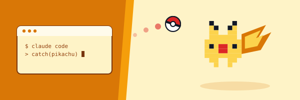

---

### Alexandre Dufour

Founder and former CEO of **Côtelé Paris** , a premium French consumer brand: 100+ retail accounts (Le Bon Marché, Printemps), international distribution across 6 markets, sold in July 2025.

Director of the Entrepreneurship & Business Transmission Observatory at **Institut Sapiens**, a French economic think tank. Author of The French SME Transmission Wave (2025-2035), presented in parliamentary hearings.

How I work

I treat AI tooling as a core operating skill, not a side interest. Claude Code is my main development environment: I ship real products with it, and I test every major model and tool release the week it comes out. Supervisor, not vibe-coder: I review every diff.

The goal is simple: stay at the frontier of what these tools make possible, and bring that leverage into whatever I run next, from data pipelines to go-to-market.

#### Live Projects
- **[Transmission Radar](https://transmission-radar.vercel.app)** — SME acquisition intelligence tool, built as a companion to my Institut Sapiens research. BODACC/SIRENE data pipeline to front end.
- **[Matcher 2027](https://matcher-2027.vercel.app)** — civic-tech MVP of a non-partisan election matching tool. Fictional data, built to explore the format.
- **[ADAM Agency](https://adam-agency-chi.vercel.app)** — my strategy consulting practice for consumer brand founders.

#### Me retrouver
- [LinkedIn](https://www.linkedin.com/in/alexandredufour1/) · 15K+ followers
- [Institut Sapiens](https://www.institutsapiens.fr/)
